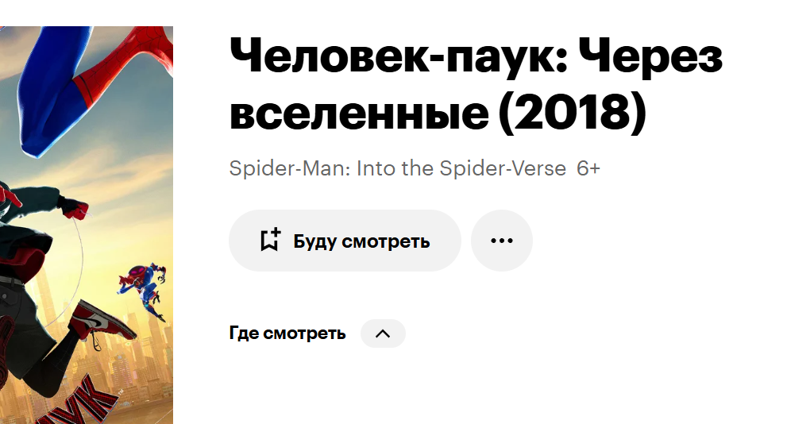
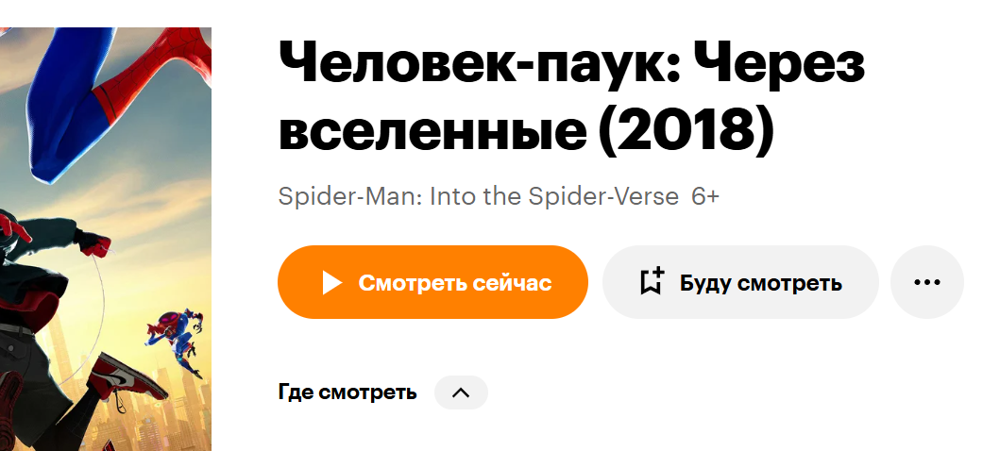

## Что это?

Простейший скрипт для [Кинопоиска](https://www.kinopoisk.ru/), добавляющий кнопку "Смотреть сейчас" с кастомной ссылкой. Позволяет быстро переходить на страницу просмотра фильма/сериала на иных сайтах.

<figure>
  
  <figcaption>До установки скрипта</figcaption>
</figure>

<figure>
  
  <figcaption>После установки скрипта</figcaption>
</figure>

## Использование

1. Установите расширение [Tampermonkey](https://www.tampermonkey.net/) для вашего браузера.
2. Перейдите по ссылке на скрипт [на сайте Greasyfork](https://greasyfork.org/ru/scripts/542571-%D0%BA%D0%BD%D0%BE%D0%BF%D0%BA%D0%B0-%D1%81%D0%BC%D0%BE%D1%82%D1%80%D0%B5%D1%82%D1%8C-%D0%B4%D0%BB%D1%8F-%D0%BA%D0%B8%D0%BD%D0%BE%D0%BF%D0%BE%D0%B8%D1%81%D0%BA%D0%B0) и нажмите "Установить".
3. Рядом с кнопкой "Буду смотреть" появится новая кнопка "Смотреть сейчас". При нажатии на неё откроется страница с тем же адресом, но на домене, который вы указали (по умолчанию — `sspoisk.ru`).

## Кастомизация

Редактировать домен можно в файле `script.js` в строке `const DEFAULT_REPLACE_DOMAIN = 'sspoisk.ru';`. Тут можно указать любой домен, который будет использоваться для замены оригинального `kinopoisk.ru`.

## Лицензия

Это чудо распространяется под лицензией MIT. См. файл [LICENSE](LICENSE.txt) для подробностей.