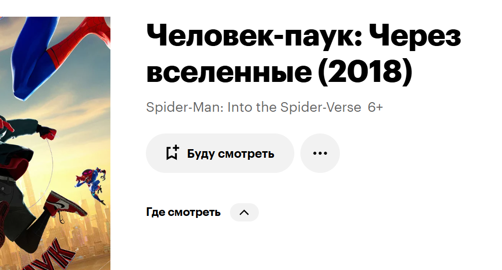
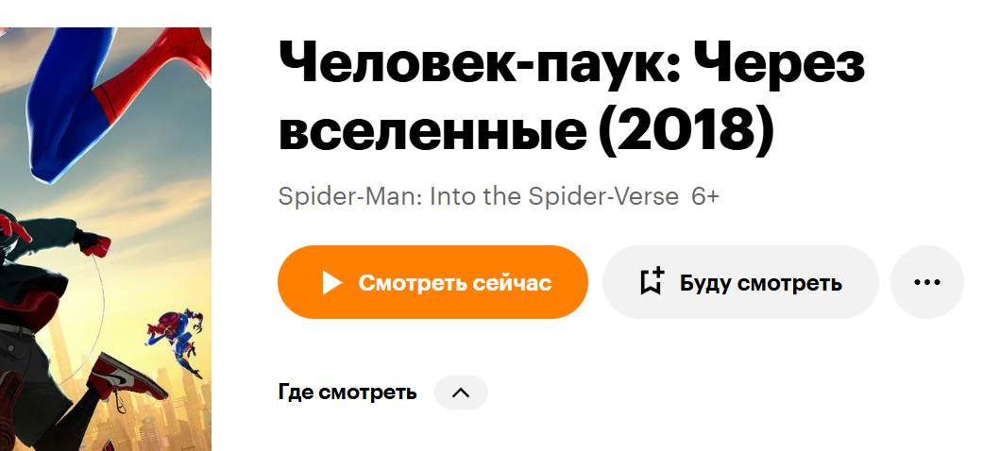

  

## Что это?

Простейший скрипт для [Кинопоиска](https://www.kinopoisk.ru/), добавляющий кнопку "Смотреть сейчас" с кастомной ссылкой. Позволяет быстро переходить на страницу просмотра фильма/сериала на иных сайтах.

<figure>
  
  <figcaption>До установки скрипта</figcaption>
</figure>

<figure>
  
  <figcaption>Пример расположения кнопки после установки скрипта</figcaption>
</figure>

## Использование

1. Установите расширение [Tampermonkey](https://www.tampermonkey.net/) для вашего браузера.
2. Перейдите по ссылке на скрипт [на сайте Greasyfork](https://greasyfork.org/ru/scripts/542571-%D0%BA%D0%BD%D0%BE%D0%BF%D0%BA%D0%B0-%D1%81%D0%BC%D0%BE%D1%82%D1%80%D0%B5%D1%82%D1%8C-%D0%B4%D0%BB%D1%8F-%D0%BA%D0%B8%D0%BD%D0%BE%D0%BF%D0%BE%D0%B8%D1%81%D0%BA%D0%B0) и нажмите "Установить".
3. Откройте страницу фильма или сериала на Кинопоиске.
4. Нажмите `Смотреть (Kinogo)` или `Lordfilm` рядом с кнопкой `Буду смотреть`.

Скрипт откроет Google с запросом, содержащим название, год и выбранный сайт. Затем он найдёт первый результат, URL которого содержит `kinogo` или `lordfilm`, и откроет его в этой же новой вкладке.

Автоматический переход работает только для поисковых вкладок, открытых кнопками скрипта. Обычные поиски Google не затрагиваются. Если подходящий результат не найден или Google показывает проверку, вкладка останется на странице поиска для ручного выбора.

## Лицензия

Это чудо распространяется под лицензией MIT. См. файл [LICENSE](LICENSE.txt) для подробностей.